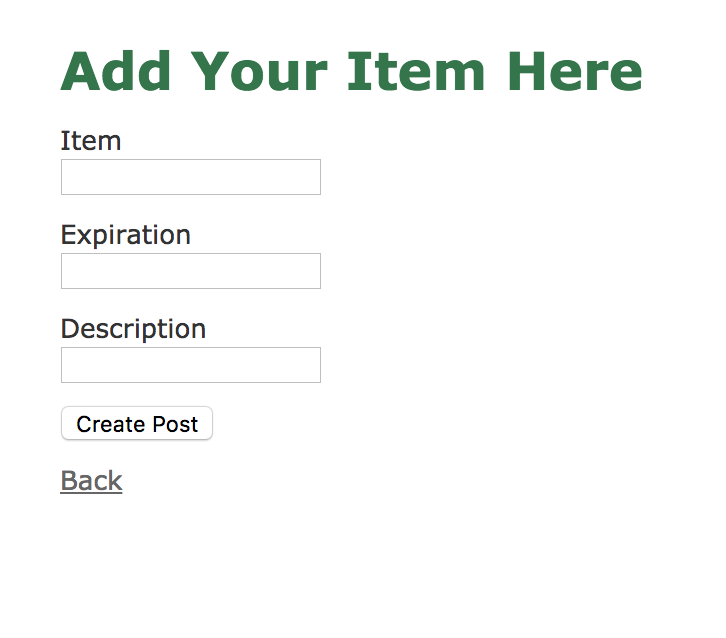
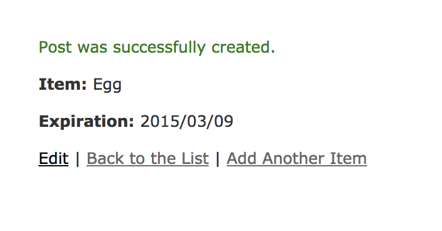
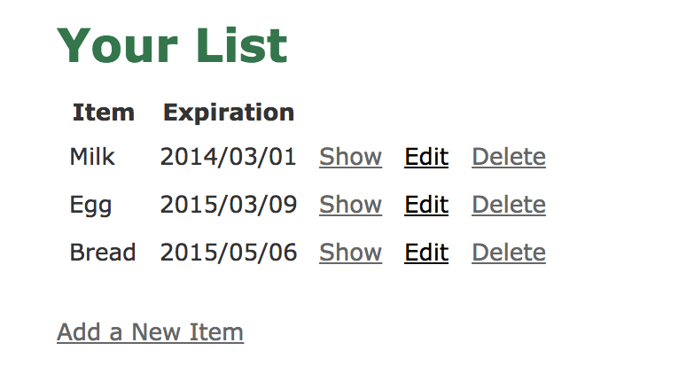

# README

This is an Creative Rails Project for CS121 course at HMC Spring 2018.

## Contributors
James Ren, Ziyuan Shang, Yucheng Wu, Yun Zhang

## Summary
“Freshly” is a web-based app that can track and manage your food inventory in your home to save your money and cut food waste! With a list of your food along with its countdown days till expiration, you can easily check what food you have left, which you should consume first and reduce food waste. 

## Users
People who need to manage their food at home.

## Description of MVP
Our MVP allows users to add food items along with its expiration date to the food list. The list entries are in the order of respective expiration dates of corresponding food items. Users could also edit and delete specific entries on the food list. Finally, users will be notified when food items are about to expire.

## Functionality
**Feature 1**：Welcome Page allow user to choose the action “Add Item” or “View List”
 

*Welcome Page*
**Feature 2**： Allow users to manually input their item and its expiration date.

*Add your Item*

 

*Successfully add item*

**Feature 3**：Display all items users previously entered in a list sorted by expiration date in a chronological order.

*Food List*

## installation steps 
1. Clone from github.

2. Setup local database 
`mysql -u root -p`
`CREATE DATABASE freshly_development`
`CREATE DATABASE freshly_test`
`GRANT ALL PRIVILEGES ON freshly_development.* TO ‘freshly_user’ IDENTIFIED BY ‘freshly’;`
`GRANT ALL PRIVILEGES ON freshly_test.* TO ‘freshly_user’ IDENTIFIED BY ‘freshly’;`
`exit`

3. Run `rails server`
4. Put the localhost address in your browser. (:localhost.3000)

## issues 
### Key issues

1. Problem: We named the parameter denoting the expiration date incorrectly. 
Solution: We read through our code base and change all of them because Ruby obviously does not allow “_” in the names of such parameters.⋅⋅
2. Problem: After pulling the initial project frame from github created by one member, we were unable to run the server. 
Solution: We still had to setup a local database to run. 
3. Problem: we could not push our files to the github because of branch conflicts. 
Solution: We soon realized that we had conflicts in the file, and we had to solve all conflicts before pushing to the github.

### Known bugs
1. Problem: Sorting of expiration date in the form of mm/dd/yyyy is not yet achieved.
Tried Options:  We searched many relevant websites, and found no results.
2. Problem: Ubuntu user had problem installing bundler when config database. 
Tried Options: Bundler is unable to automatically install in Ubuntu Linux system. Need to run sudo apt-get install bundler.
3. Problem: Ubuntu user is unable to find local database after granted privilege and run the server.
Tried Options: Granted privilege and tried different passwords according to tutorial. Still unable to find local database.

## References. 
Skoglund, K. (2016, September 28). Retrieved February 12, 2018, from https://www.lynda.com/Ruby-Rails-tutorials/Installing-Running-Ruby-Rails-5-Mac/500549-2.html
Skoglund, K. (2016, September 28). Retrieved February 12, 2018, from https://www.lynda.com/Ruby-Rails-tutorials/Installing-Running-Ruby-Rails-5-Mac/500549-2.html
Hansson, D. (2016, June 02). Retrieved February 12, 2018, from https://www.youtube.com/watch?v=OaDhY_y8WTo

